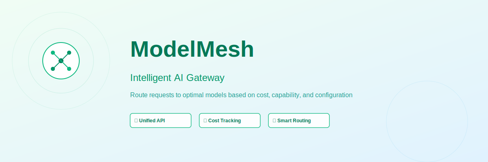

# DevForgeAI

An intelligent AI development platform for multi-agent orchestration, image generation, and workflow automation. Built with FastAPI + Next.js 14.



---

## What It Does

DevForgeAI brings together everything you need to build with AI:

- **Chat** with multiple AI models through a single interface (Ollama, Anthropic, Google, OpenRouter)
- **Agents** that can code, research, design, review, plan, and write — each backed by a persona
- **Live Workbench** — watch agents work in real-time, intervene mid-task
- **Image Generation** via Gemini Imagen or ComfyUI with gallery management
- **Projects** — point agents at any directory on your machine
- **Development Methods** — BMAD, GSD, SuperPowers, GTrack (stackable)
- **Identity System** — the AI learns who you are through onboarding (SOUL.md + USER.md)
- **Process Isolation** — per-project Python venvs, git snapshots, rollbacks
- **Collaboration** — multi-user support, shared workspaces, session handoffs, audit log

---

## Stack

| Layer | Tech |
|---|---|
| Backend | Python 3.14, FastAPI, SQLite (aiosqlite), LiteLLM |
| Frontend | Next.js 14, React 18, TailwindCSS |
| AI Providers | Ollama (local), Anthropic, Google Gemini, OpenRouter |
| Image Gen | Gemini Imagen, ComfyUI |
| Ports | Backend: 19000 · Frontend: 3001 |

---

## Quick Start

> **Full installation guide:** [INSTALL.md](INSTALL.md)

### Prerequisites

- Python 3.11+ — https://www.python.org/downloads/
- Node.js 18+ — https://nodejs.org/
- At least one AI provider API key *(Ollama works locally with no key)*

### 1. Clone

```bash
git clone https://github.com/chriskesler35/model_mesh.git
cd model_mesh
```

### 2. Install

```bash
python install.py
```

This creates the virtual environment, installs all dependencies, and generates start scripts.

### 3. Configure

Edit `backend/.env` and add at least one API key:

```env
ANTHROPIC_API_KEY=sk-ant-...
GOOGLE_API_KEY=AIza...
OPENROUTER_API_KEY=sk-or-v1-...
# or just run Ollama locally — no key needed
OLLAMA_BASE_URL=http://localhost:11434
```

### 4. Start

```bash
python devforgeai.py start
```

Or double-click `start.bat` (Windows) / run `./start.sh` (macOS/Linux).

### 5. Open

- **App:** http://localhost:3001
- **API docs:** http://localhost:19000/docs

First launch runs onboarding — the AI asks a few questions to set up your profile.

---

## Features

### Chat
- OpenAI-compatible chat completions
- Multiple personas (each with its own model, system prompt, and routing rules)
- Conversation history with pin, keep-forever, rename
- Inline image generation
- **Slash commands:** `/reset`, `/onboard`, `/persona`, `/model`, `/image`, `/pin`, `/export`, `/theme`, `/method`, `/help`

### Agents
- 7 built-in agent types: Coder, Researcher, Designer, Reviewer, Planner, Executor, Writer
- Each agent is backed by a **Persona** (model resolved through persona chain)
- Custom system prompts, tool lists, iteration limits
- Live Sessions dashboard with real-time status

### Live Workbench
- Start a workbench session → watch the agent work in real-time
- 3-panel layout: file tree (left) · event stream (center) · file preview (right)
- **Intervention console** — send messages to the agent mid-task
- Agent pauses and surfaces a prompt when human input is required
- SSE-based streaming (`/v1/workbench/sessions/{id}/stream`)

### Image Gallery
- Generate images with Gemini Imagen or ComfyUI
- Auto-fallback to Gemini if ComfyUI is unavailable
- Gallery with lightbox, download, delete, variations
- Upload images and edit them with AI prompts
- Drag-and-drop upload

### Development Methods
Five methods that shape how the AI approaches work — activatable individually or **stacked**:

| Method | Mode |
|---|---|
| 💬 Standard | Default behavior |
| 🧠 BMAD | Brainstorm → Model → Architect → Deploy |
| ⚡ GSD | Get Shit Done — ship fast, iterate |
| 🦸 SuperPowers | Deep decompose → research → synthesize |
| 📊 GTrack | Git-tracked — commit after every change |

Switch via UI or slash command: `/method bmad`

### Projects
- Register any directory on your machine as a project
- Templates: blank, python-api, next-app, cli-tool
- Browse file tree, preview files
- Launch directly into Workbench
- **Sandbox tab:** Python venv, pip install, git init, snapshots + rollback, .env editor

### Identity System
- **SOUL.md** (`data/soul.md`) — AI personality injected into every conversation
- **USER.md** (`data/user.md`) — built during onboarding, what the AI knows about you
- Both editable from **Settings → Identity**
- Reset onboarding anytime

### Settings
- **Identity** — Edit SOUL.md and USER.md, reset onboarding
- **Profile** — User profile
- **Memory Files** — Custom context files injected into chat
- **Preferences** — Learned preferences
- **Conversations** — Browse, open, delete conversations
- **API Keys** — Manage provider keys (stored in .env, never exposed in full)

### Collaboration
- Local user accounts with roles (owner/admin/member/viewer)
- Shared workspaces grouping projects and members
- Session handoff — pass a conversation between users
- Full audit log (last 1000 events)

---

## API

Full OpenAPI docs at `http://localhost:19000/docs`

Key endpoints:

```
POST /v1/chat/completions          Chat (OpenAI-compatible)
GET  /v1/conversations             List conversations
GET  /v1/personas                  List personas
GET  /v1/agents                    List agents
POST /v1/agents                    Create agent
GET  /v1/images/                   List generated images
POST /v1/images/generations        Generate image
GET  /v1/workbench/sessions        List workbench sessions
POST /v1/workbench/sessions        Start workbench session
GET  /v1/workbench/sessions/{id}/stream  SSE stream
POST /v1/projects/                 Create project
GET  /v1/projects/{id}/files       Browse project files
GET  /v1/methods/                  List methods
POST /v1/methods/activate          Set active method
POST /v1/methods/stack             Set method stack
GET  /v1/identity/status           Check onboarding status
GET  /v1/sandbox/projects/{id}/status  Sandbox status
POST /v1/sandbox/projects/{id}/snapshot  Create git snapshot
GET  /v1/collab/users              List users
GET  /v1/collab/audit              Audit log
```

---

## Project Structure

```
model_mesh/
├── backend/
│   ├── app/
│   │   ├── main.py              # FastAPI app, router registration
│   │   ├── config.py            # Settings from .env
│   │   ├── database.py          # SQLite async engine
│   │   ├── migrate.py           # Column migrations (idempotent)
│   │   ├── seed.py              # Default data seeding
│   │   ├── models/              # SQLAlchemy ORM models
│   │   ├── routes/              # API route handlers
│   │   │   ├── chat.py          # Chat completions
│   │   │   ├── agents.py        # Agent CRUD + persona resolution
│   │   │   ├── images.py        # Image generation + gallery
│   │   │   ├── workbench.py     # Live workbench + SSE
│   │   │   ├── projects.py      # Project management
│   │   │   ├── methods.py       # Development methods
│   │   │   ├── identity.py      # SOUL.md + USER.md
│   │   │   ├── sandbox.py       # Venv, git, snapshots
│   │   │   └── collaboration.py # Users, workspaces, audit
│   │   ├── schemas/             # Pydantic request/response schemas
│   │   └── services/            # Business logic (routing, memory)
│   └── .env                     # API keys and config (not committed)
├── frontend/
│   ├── src/app/
│   │   ├── chat/                # Chat interface with slash commands
│   │   ├── (main)/
│   │   │   ├── agents/          # Agent list + detail + sessions
│   │   │   ├── workbench/       # Live workbench + session view
│   │   │   ├── projects/        # Project list + detail + sandbox
│   │   │   ├── gallery/         # Image gallery
│   │   │   ├── methods/         # Development methods
│   │   │   ├── collaborate/     # Users, workspaces, handoffs
│   │   │   ├── personas/        # Persona management
│   │   │   ├── models/          # Model management
│   │   │   ├── stats/           # Usage stats
│   │   │   └── settings/        # Settings tabs
│   │   └── Navigation.tsx       # Top nav
│   └── package.json
├── data/
│   ├── devforgeai.db            # SQLite database
│   ├── soul.md                  # AI identity (editable)
│   ├── user.md                  # User profile (built during onboarding)
│   ├── images/                  # Generated images
│   └── projects.json            # Project registry
└── devforgeai_startup.bat       # Windows startup script
```

---

## Environment Variables

```env
# Database
DATABASE_URL=sqlite+aiosqlite:///data/devforgeai.db

# AI Providers (at least one required)
ANTHROPIC_API_KEY=
GOOGLE_API_KEY=
GEMINI_API_KEY=
OPENROUTER_API_KEY=
OPENAI_API_KEY=

# Local AI
OLLAMA_BASE_URL=http://localhost:11434

# Image Generation
COMFYUI_URL=http://localhost:8188

# App
MODELMESH_API_KEY=modelmesh_local_dev_key

# Telegram (optional)
TELEGRAM_BOT_TOKEN=
TELEGRAM_CHAT_IDS=
```

---

## Remote Access (Tailscale)

```powershell
# Run as Administrator — allow Tailscale subnet only
netsh advfirewall firewall add rule name="DevForgeAI API" dir=in action=allow protocol=tcp localport=19000 remoteip=100.64.0.0/10
netsh advfirewall firewall add rule name="DevForgeAI Frontend" dir=in action=allow protocol=tcp localport=3001 remoteip=100.64.0.0/10
```

Access from any Tailnet device:
- Frontend: `http://100.106.217.99:3001`
- API: `http://100.106.217.99:19000`

---

## License

MIT
